Normal_Colon_125
================
yutian
2022-12-22

``` r
library(readxl)
library(dplyr)
library(cowplot)
library(ggplot2)
library(ggpubr)
library(devtools)
library(Matrix)
library(data.table)
```

# Normal Colon data

Read Single cell RNA-seq data from normal colon (GSE125970 (38)).For
normal colon, all rectal and colon cells were analyzed, and all
epithelial cells were analyzed for the CRCs. Raw reads were converted to
CPM (reads divided by total reads) and then to log2CPM (x+1). Average
gene log2CPM expression and log2CPM variance were calculated for all
cells, including zero values.

Colon epithelial average gene expression (log2 CPM) and variability
(variance) can be calculated from single cell RNA-seq data.

Based on DepMap data \[1\] to identify “essential” genes.

``` r
nmx <- readxl::read_xlsx("Normal_colon.xlsx")
```

``` r
change_col_name <- function(df){
  colnames(df)[2] <-"Log2_CPM"
  colnames(df)[3] <-"Log2_CPM_variance"
  colnames(df)[4] <-"NN3_genePWD"
  return(df)
}
dfs <- list(Nona_NN)
Nona_NN <-lapply(dfs, change_col_name )
Nona_NN <- rbindlist(Nona_NN)
dfs <- list(Nona_essential_depmap)
Nona_essential_depmap <-lapply(dfs, change_col_name )
Nona_essential_depmap <- rbindlist(Nona_essential_depmap)
dfs <- list(Nona_NotDepMap)
Nona_NotDepMap <-lapply(dfs, change_col_name )
Nona_NotDepMap <- rbindlist(Nona_NotDepMap)
```

## DepMap Essential Genes

``` r
cor(Nona_essential_depmap$NN3_genePWD, Nona_essential_depmap$Log2_CPM, method = c("pearson", "kendall", "spearman"))
```

    ## [1] -0.2834464

``` r
cor.test(Nona_essential_depmap$NN3_genePWD, Nona_essential_depmap$Log2_CPM, method=c("pearson", "kendall", "spearman"))
```

    ## 
    ##  Pearson's product-moment correlation
    ## 
    ## data:  Nona_essential_depmap$NN3_genePWD and Nona_essential_depmap$Log2_CPM
    ## t = -10.023, df = 1150, p-value < 2.2e-16
    ## alternative hypothesis: true correlation is not equal to 0
    ## 95 percent confidence interval:
    ##  -0.3357076 -0.2294457
    ## sample estimates:
    ##        cor 
    ## -0.2834464

If the correlation coefficient is greater than zero, it is a positive
relationship. Conversely, if the value is less than zero, it is a
negative relationship. A value of zero indicates that there is no
relationship between the two variables. From the result, negative and
significant correlations (p \< 0.05) were observed between gene PWDs and
gene expression/variability.

``` r
cor.test(Nona_essential_depmap$NN3_genePWD, Nona_essential_depmap$Log2_CPM, alternative = "less")
```

    ## 
    ##  Pearson's product-moment correlation
    ## 
    ## data:  Nona_essential_depmap$NN3_genePWD and Nona_essential_depmap$Log2_CPM
    ## t = -10.023, df = 1150, p-value < 2.2e-16
    ## alternative hypothesis: true correlation is less than 0
    ## 95 percent confidence interval:
    ##  -1.0000000 -0.2382335
    ## sample estimates:
    ##        cor 
    ## -0.2834464

### Visualization

#### Figures Reproduced

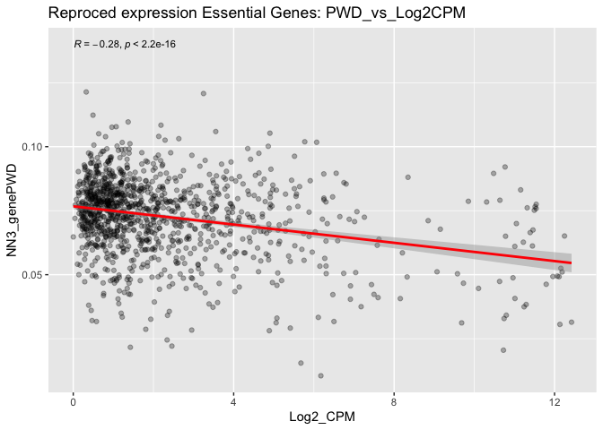<!-- -->
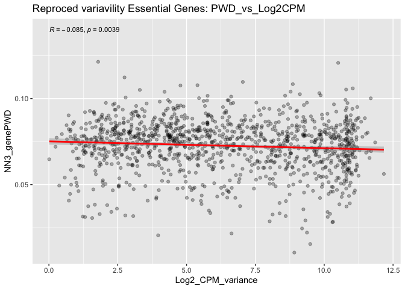<!-- -->

#### Density Plots & Change Y-X axis

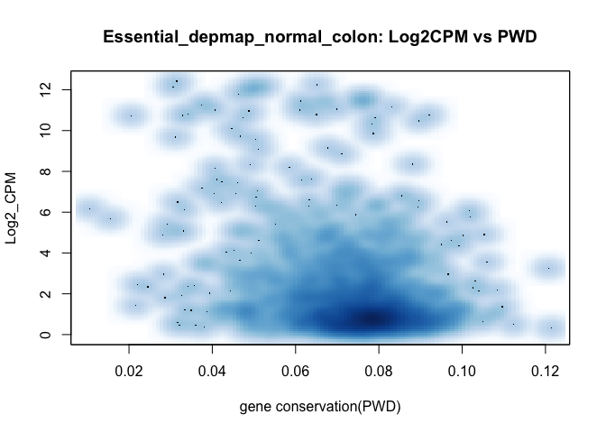<!-- -->
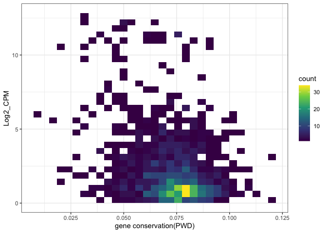<!-- -->

Many PWDs are concentrated in the range from 0.06 to 0.08

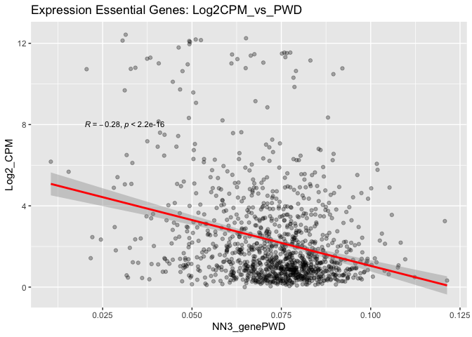<!-- -->

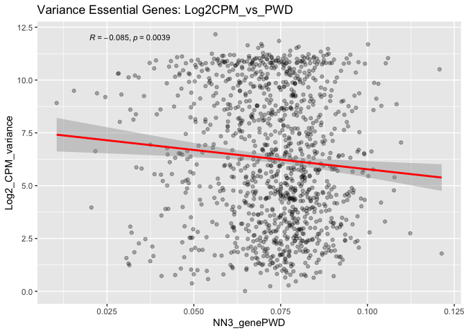<!-- -->

## Non-DepMap Essential Genes

``` r
cor(Nona_NotDepMap$NN3_genePWD, Nona_NotDepMap$Log2_CPM, method = c("pearson", "kendall", "spearman"))
```

    ## [1] -0.2655226

``` r
cor.test(Nona_NotDepMap$NN3_genePWD, Nona_NotDepMap$Log2_CPM, method=c("pearson", "kendall", "spearman"))
```

    ## 
    ##  Pearson's product-moment correlation
    ## 
    ## data:  Nona_NotDepMap$NN3_genePWD and Nona_NotDepMap$Log2_CPM
    ## t = -31.747, df = 13288, p-value < 2.2e-16
    ## alternative hypothesis: true correlation is not equal to 0
    ## 95 percent confidence interval:
    ##  -0.2812547 -0.2496479
    ## sample estimates:
    ##        cor 
    ## -0.2655226

### Visualization

#### Figures Reproduced

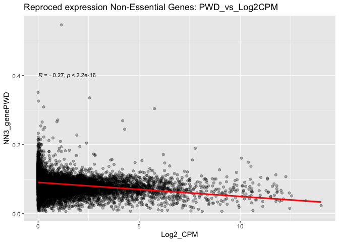<!-- -->
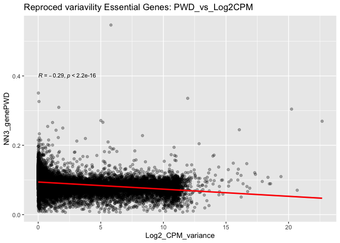<!-- -->

#### Density Plots & Change Y-X axis

<!-- -->

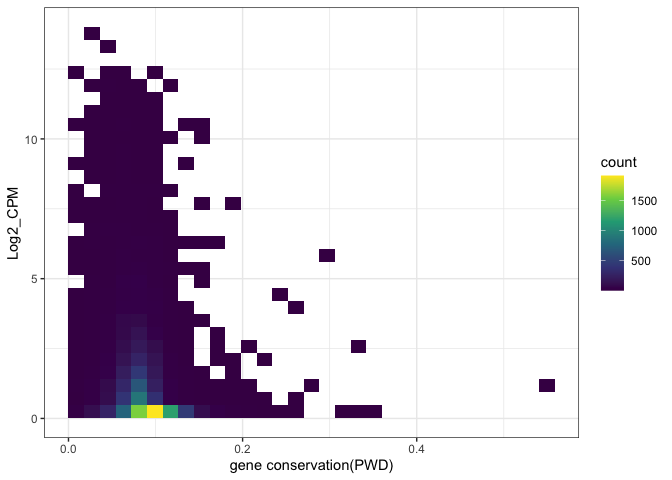<!-- -->

Many PWDs are concentrated in the range from 0.05 to 0.15

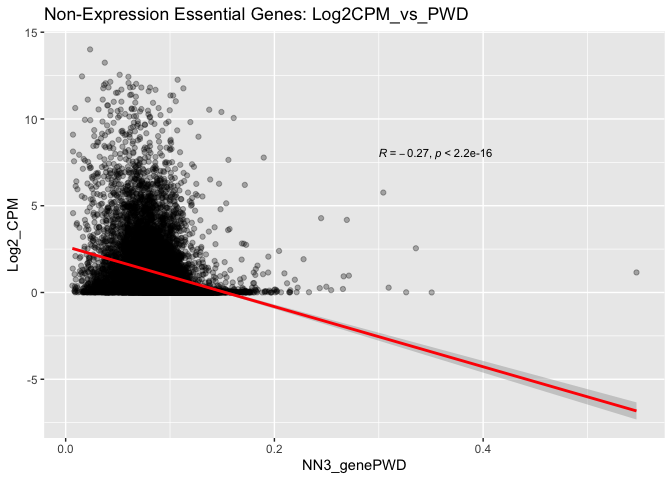<!-- -->

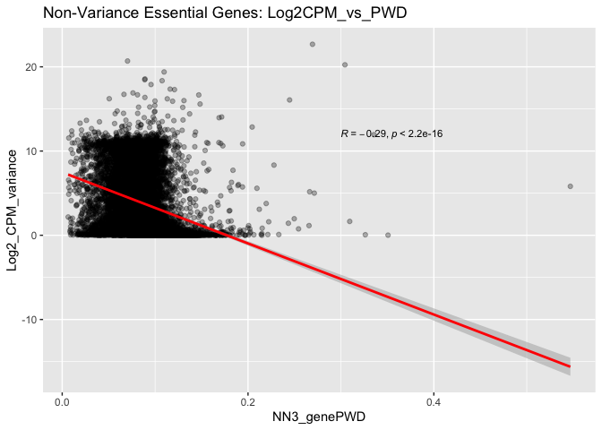<!-- -->

## Conclusion

More variably and highly expressed genes are more conserved in normal
and neoplastic colon. Negative and significant correlations (p \< 0.05)
were observed between gene PWDs and gene expression/variability. PWDs in
DepMap essential genes are concentrated in the range from 0.06 to 0.08
and PWDs in Non-DepMap essential gene are concentrated in the range from
0.05 to 0.15.

## References

\[1\]. Behan FM, Iorio F, Picco G, Gonçalves E, Beaver CM, Migliardi G,
et al. Prioritization of cancer therapeutic targets using CRISPR-Cas9
screens. Nature. 2019Apr;568(7753): 511–516. doi:
10.1038/s41586-019-1103-9
