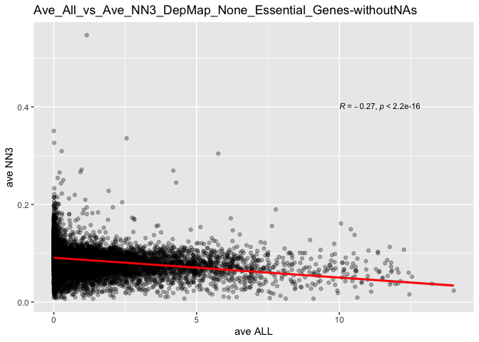
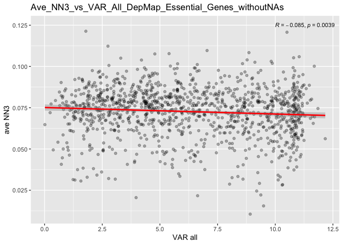
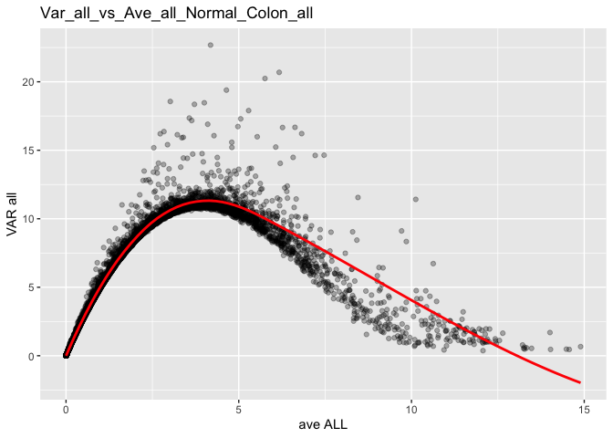
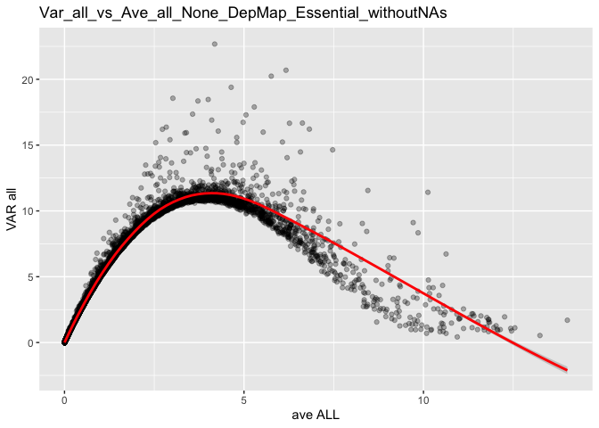
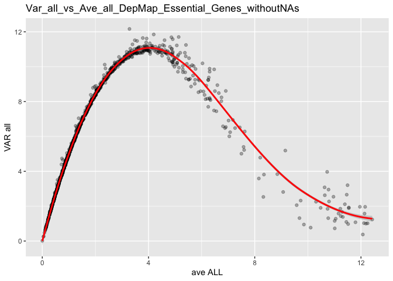

Normal_Colon
================
yutian
2022-10-10

``` r
library(readxl)
library(dplyr)
library(cowplot)
library(ggplot2)
library(ggpubr)
library(devtools)
```

# Normal Colon

``` r
nmx <- readxl::read_xlsx("Normal_colon.xlsx")
head(nmx)
```

    ## # A tibble: 6 × 7
    ##   GENE     `ave ALL` `VAR all` `ave NN3`  aveAd3 aveCRC8 `common essential Dep…`
    ##   <chr>        <dbl>     <dbl>     <dbl>   <dbl>   <dbl>                   <dbl>
    ## 1 AAMP         3.73      10.9     0.0589  0.0627  0.0552                       2
    ## 2 AASDHPPT     0.872      4.42    0.0559  0.0573  0.0516                       4
    ## 3 ABCB7        0.962      4.76   NA      NA      NA                            5
    ## 4 ABCE1        1.56       7.03    0.0591  0.0613  0.0579                       6
    ## 5 ABCF1        2.19       8.94   NA      NA      NA                            7
    ## 6 ABT1         1.86       7.88    0.0548  0.0607  0.0512                       8

## Data Preprocess

``` r
summary(nmx$`ave ALL`)
```

    ##     Min.  1st Qu.   Median     Mean  3rd Qu.     Max. 
    ##  0.00000  0.02371  0.32752  1.04824  1.32608 14.89461

``` r
summary(nmx$`ave NN3`)
```

    ##    Min. 1st Qu.  Median    Mean 3rd Qu.    Max.    NA's 
    ##   0.006   0.071   0.083   0.085   0.099   0.547    5083

### Separate Common & Non Common Essential DepMap genes

``` r
# Common essential Depmap gene 
depm <-nmx %>%
  filter(nmx$`common essential DepMap`!="#N/A")
```

``` r
# Non essential Dep Map gene 
Ndepm <-nmx[1220:19525,]
```

### Remove missing values

``` r
Nona_depm <- dplyr::filter(depm, !is.na(`ave NN3`))
Nona_Ndepm <- dplyr::filter(Ndepm, !is.na(`ave NN3`))
```

## Smooth Plots

``` r
smoothScatter(nmx$`ave ALL`,nmx$`ave NN3`,main = "All Normal Colon")
```

<!-- -->

``` r
smoothScatter(Nona_depm$`ave ALL`,Nona_depm$`ave NN3`,main = "Common Essential DepMap ave_NN3 vs ave_ALLwithout NA values ")
```

<!-- -->

``` r
smoothScatter(Nona_Ndepm$`ave ALL`,Nona_Ndepm$`ave NN3`,main = "None Common Essential DepMap NN3 without NA values ")
```

<!-- -->

## Scatter plot Av3_NN3 vs Ave_All

``` r
Nona_nmx <-nmx %>%
  filter(!is.na(`ave NN3`) & !is.na(`ave ALL`))
```

``` r
ggplot(Nona_nmx,aes(`ave ALL`,`ave NN3`)) + geom_point(alpha = 0.3) + geom_smooth(method = "lm",color="red",formula = y~x) + stat_cor(method = "pearson", label.x = 10, label.y = 0.4,size=3)+ggtitle("Ave_All_vs_Ave_NN3_Normal_Colon_withoutNAs")
```

<!-- -->

``` r
ggplot(Nona_Ndepm,aes(`ave ALL`,`ave NN3`)) + geom_point(alpha = 0.3) + geom_smooth(method = "lm",color="red",formula = y~x) + stat_cor(method = "pearson", label.x = 10, label.y = 0.4,size=3)+ggtitle("Ave_All_vs_Ave_NN3_DepMap_None_Essential_Genes-withoutNAs")
```

<!-- -->

``` r
ggplot(Nona_depm,aes(`VAR all`,`ave NN3`)) + geom_point(alpha = 0.3)+geom_smooth(method = "lm",color="red",formula = y~x)+ stat_cor(method = "pearson", label.x = 10, label.y = 0.125,size=3)+ggtitle("Ave_NN3_vs_VAR_All_DepMap_Essential_Genes_withoutNAs")
```

<!-- -->

## Scatter plot Var_All vs Ave_All

``` r
ggplot(nmx,aes(`ave ALL`,`VAR all`)) + geom_point(alpha = 0.3)+geom_smooth(se = FALSE,formula = y ~x,method = 'loess',span = .2,color = "red")+ggtitle("Var_all_vs_Ave_all_Normal_Colon_all")
```

<!-- -->

``` r
ggplot(Nona_Ndepm,aes(`ave ALL`,`VAR all`)) + geom_point(alpha = 0.3)+geom_smooth(method = "loess",color="red",formula = y~x,span = .2)+ggtitle("Var_all_vs_Ave_all_None_DepMap_Essential_withoutNAs")
```

<!-- -->

``` r
ggplot(Nona_depm,aes(`ave ALL`,`VAR all`)) + geom_point(alpha = 0.3)+geom_smooth(method = "loess",color="red",formula = y~x,span = .2)+ggtitle("Var_all_vs_Ave_all_DepMap_Essential_Genes_withoutNAs")
```

<!-- -->

``` r
summary(Nona_nmx)
```

    ##      GENE              ave ALL            VAR all           ave NN3       
    ##  Length:14442       Min.   : 0.00000   Min.   : 0.0000   Min.   :0.00644  
    ##  Class :character   1st Qu.: 0.07282   1st Qu.: 0.4248   1st Qu.:0.07068  
    ##  Mode  :character   Median : 0.59043   Median : 3.0514   Median :0.08337  
    ##                     Mean   : 1.24761   Mean   : 4.0339   Mean   :0.08504  
    ##                     3rd Qu.: 1.62689   3rd Qu.: 7.0525   3rd Qu.:0.09853  
    ##                     Max.   :14.00765   Max.   :22.6777   Max.   :0.54692  
    ##                                                                           
    ##      aveAd3           aveCRC8         common essential DepMap
    ##  Min.   :0.01131   Min.   :0.008636   Min.   :   2.0         
    ##  1st Qu.:0.07227   1st Qu.:0.066353   1st Qu.: 310.8         
    ##  Median :0.08257   Median :0.078760   Median : 630.5         
    ##  Mean   :0.08917   Mean   :0.086798   Mean   : 626.7         
    ##  3rd Qu.:0.10307   3rd Qu.:0.105035   3rd Qu.: 939.2         
    ##  Max.   :0.21818   Max.   :0.204857   Max.   :1248.0         
    ##                                       NA's   :13290
